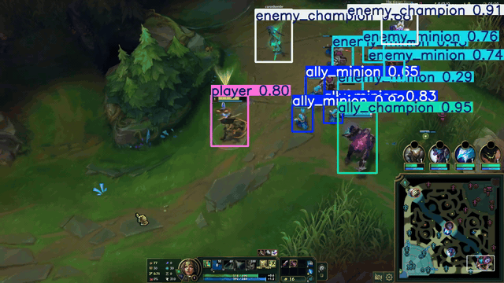

# League of Legends Object Detection

Real-time detection of in-game entities from raw League of Legends gameplay, using a fine-tuned YOLO11n detector on a dataset captured and annotated from scratch.

Six classes: `ally_minion`, `enemy_minion`, `enemy_champion`, `ally_champion`, `tower`, `player`.




---

## Why this problem

League of Legends is an unusually hostile target for an object detector, which is what makes it a useful test case:

- **Small objects.** Minions occupy a tiny fraction of the frame, and dozens are on screen at once.
- **Heavy occlusion.** Units overlap constantly, especially in melee fights and near towers.
- **Non-stationary lighting.** Ability effects can blow out an entire region of the frame for a few hundred milliseconds.
- **Partial transparency.** Champions in bushes render at roughly 0.5 opacity; stealth champions lower still.

The question: can a lightweight one-stage detector handle this on consumer hardware, fine-tuned on a small domain-specific dataset rather than a large public one?

---

## Results

YOLO11n, 30 epochs, 640×640, evaluated on the validation split (games 15–17):

| Metric | Value |
|---|---|
| Precision | 0.867 |
| Recall | 0.885 |
| mAP@50 | **0.925** |
| mAP@50-95 | 0.672 |

> These are validation-split metrics from the final training epoch. A held-out test split (games 18–20) exists and has not yet been scored separately — see [Next steps](#next-steps).

An earlier training run finished at mAP@50 0.837 with recall 0.649. Most of the gap between that run and this one came from a label indexing bug, described under [Dataset](#dataset) — a useful reminder of what a silent data error costs before you find it.

### Where the model holds up

- **Strong** in clean laning situations, including dense minion waves — it detects nearly all minions despite heavy overlap.
- **Strong** on `player` and champion classes.
- **Holds up in teamfights** despite lighting changes, though this was assessed on a limited number of clips and shouldn't be over-read.
- **Weaker on towers** — reliably detected only when more than ~80% of the structure is in frame.

### Known failure case: the blast cone

The model classifies blast cones (a terrain object) as minions. This is a legible failure rather than a random one — blast cones share both the colour palette and the overhead health-bar element that the model appears to have learned as its minion cue. This is the visible symptom of a broader issue; see [Limitations](#limitations): terrain objects are absent from the label space, so the model has no correct class to assign them.

### A separate segmentation experiment

Segmentation variants were compared on a much smaller set of **28 segmented images**:

| Model | Precision | Recall | mAP@50 | mAP@50-95 |
|---|---|---|---|---|
| YOLOv8n-seg | 0.848 | 0.414 | 0.517 | 0.345 |
| YOLO11n-seg | 0.772 | 0.395 | 0.518 | 0.337 |
| YOLO26n-seg | 0.008 | 0.167 | 0.013 | 0.005 |

**These describe segmentation, not the detection model above, and 28 images is far too few to draw architecture conclusions from.** The YOLO26n row in particular — precision 0.008 — has the signature of a run that failed to converge rather than a genuinely weaker architecture. Treat this as an unresolved side experiment pending more segmentation labels.

---

## Dataset

Built from scratch. No public dataset exists for this.

| | |
|---|---|
| Raw frames captured | 14,723 |
| Games recorded | 20 (19 used) |
| Frames manually annotated | 834 |
| Frames segmented | 28 |
| Largest class | `ally_minion` — 1,168 annotations |

The full capture set is organised per-game on local storage and runs to tens of gigabytes, so it is not distributed here. `preparation_scripts/screenshot_generator/dataset/images/` contains an early flat capture batch predating the per-game structure, kept as a sample of raw input.

**Capture.** `preparation_scripts/screenshot_generator/` screenshots the screen every 2 seconds, starting 60 seconds into the match — minions spawn at 0:30 and take roughly another 30 seconds to reach lane, so anything earlier is empty frames. Each game gets its own folder, with frame numbering continuous across sessions so the dataset can grow without collisions.

**Automatic frame filtering.** Two cheap heuristics reject frames containing no usable gameplay, avoiding a manual pass over thousands of screenshots:

- **Death screen** — detected via mean HSV saturation. The death overlay desaturates the frame, so `saturation < 20` is a reliable proxy with no template matching needed.
- **Shop open** — detected via mean brightness. The shop overlay darkens the frame, so `brightness < 40` catches it.

Remaining invalid frames — scoreboard and settings overlays — were excluded manually during annotation.

**Split by game, not by frame.** Games 1–14 train, 15–17 validation, 18–20 test. Splitting randomly across all frames would leak: consecutive screenshots two seconds apart are nearly identical, so the same visual content would land in both train and test and inflate the scores. Splitting at the game boundary keeps the evaluation honest.

**Game 4 was dropped** because the player's champion had already appeared in two earlier games, which risked over-representing one champion's visual signature.

**Label indexing fix.** The annotation export produced class IDs numbered 1–6; YOLO expects 0-indexed IDs. This raises no error — it trains, and silently corrupts the class mapping. `fix_class_ids.py` rewrites the label files down by one, backing up the originals first.

---

## Design decisions

**Why a one-stage detector.** EfficientDet-D0 was evaluated and scored below YOLOv8 on AP. Faster R-CNN was dropped as over-specified — a two-stage architecture with a much larger compute footprint, where this problem needs something light enough to run near-real-time on consumer hardware.

**Why `imgsz=640`.** The default. Raising it would likely improve small-object detection, which is exactly the weak point here — but the cost is longer training and substantially higher memory use. The clearest known trade-off in the project, and the first thing to revisit with better hardware.

**Why 30 epochs rather than 100.** With 834 labelled images, the standard 100-epoch schedule risks memorising the training set rather than learning the classes.

**Confidence threshold 0.25** at inference (default).

---

## Limitations

Stated plainly, because they bound what the numbers above mean:

- **The label space is narrower than the domain.** The six classes cover lane content only. The map contains many neutral entities the model has never seen labelled — jungle camps, epic monsters, void grubs, and summoned units such as Ivern's Daisy. A detector cannot abstain, so each of these is forced into the nearest known class. This is a consequence of the class design, not a defect in training, and it needs additional classes and negative examples rather than a different architecture.
- **Overlap-heavy scenes are under-represented.** Cluttered frames were hardest to annotate accurately, so the dataset skews toward calmer gameplay — meaning the reported metrics likely flatter real teamfight performance.
- **Bush and stealth opacity** makes some champions hard for both the model *and* the annotator.
- **Bright ability effects** from mages wash out regions of the frame.
- **Melee champions** overlap more, and melee supports die more often, yielding less usable data per game.
- **Towers** are hard to annotate consistently — they overlap with units, and their health bar changes appearance with camera angle.
- **Meta bias.** Only a small fraction of 170+ champions see regular play, so the model has seen a narrow slice of the visual space.
- **Single-domain.** One game, one UI, one resolution.

---

## Repository structure

├── preparation_scripts/
│   ├── make_demo_gif.py          # exports size-bounded demo GIFs from prediction video
│   └── screenshot_generator/     # frame capture tool (own README and requirements)
├── runs/                         # training runs and inference output
├── docs/                         # demo assets
├── video_clips/                  # raw gameplay clips used as inference input
├── dataset.yaml                  # class names and split paths
├── train_yolo.py                 # training entry point
├── run_inference.py              # inference on images or video
├── fix_class_ids.py              # one-off: rewrite label class IDs from 1-6 to 0-5
└── check_setup.py                # environment / CUDA check

Inside `runs/`: `lol_detect_baseline` through `baseline3` are YOLO11n detection runs,
`lol_detect_yolov8n` and `lol_detect_yolo26n` are the segmentation comparison, and
`predict_images` / `predict_video` / `predict_video2` hold inference output.

---

## Running it

Requires Python 3.13+ and [Ultralytics](https://docs.ultralytics.com/).

```bash
pip install ultralytics

# capture frames — see screenshot_generator/README.md for setup
cd preparation_scripts/screenshot_generator
pip install -r requirements.txt
python screenshot_generator.py

# train — set the `path:` in dataset.yaml first
python train_yolo.py

# inference — prompts for "images" or "video"
python run_inference.py

# export a demo GIF from prediction output (prompts if run with no arguments)
python preparation_scripts/make_demo_gif.py
```

Training writes to `runs/lol_detect_baseline*/`. Inference loads `runs/lol_detect_baseline3/weights/best.pt` and writes annotated output to `runs/predict_images/` or `runs/predict_video/`.

> **Reproducing training:** annotation label files are not distributed with this repository, so `train_yolo.py` cannot be re-run as-is. Trained weights are provided in `runs/lol_detect_baseline3/weights/best.pt` for inference.

---

## Next steps

- **Score the held-out test split (games 18–20).** Validation metrics are reported above; the test split has never been scored, and that is the number that actually means something.
- Expand segmentation labels well beyond 28 images and re-run the model comparison properly.
- Split minions into four classes (melee, caster, siege, super) rather than the current ally/enemy binary.
- Add jungle classes — camps, scuttle crab, epic monsters — most efficiently collected by recording jungle games.
- Add wards and traps.
- Improve detection under high-brightness teamfight conditions.
- Test against modified UIs, which a meaningful share of players use.
